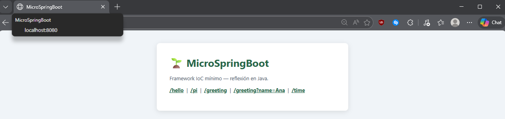
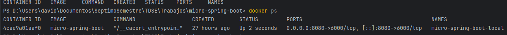
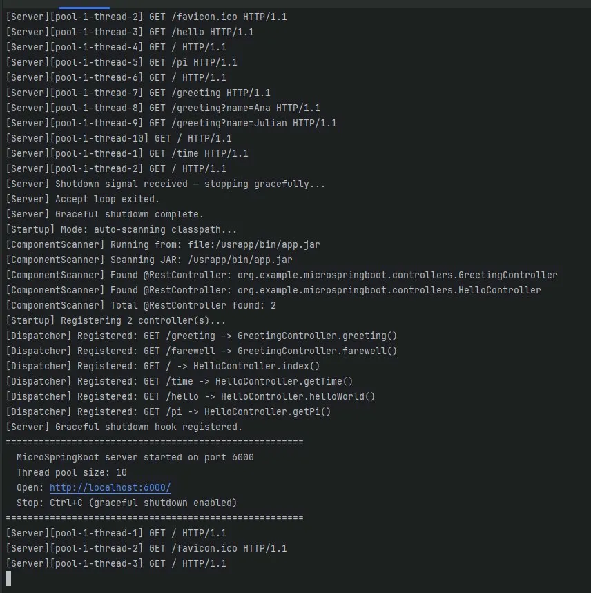
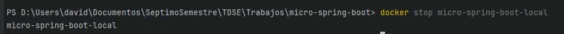
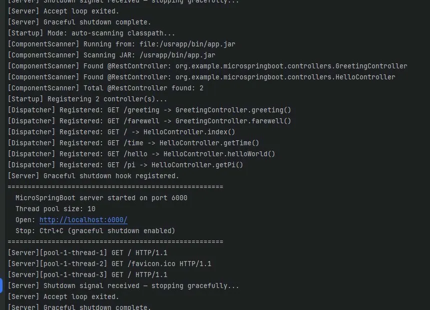
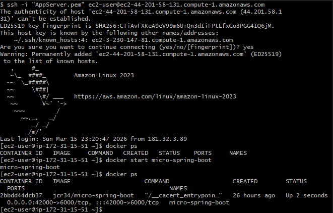
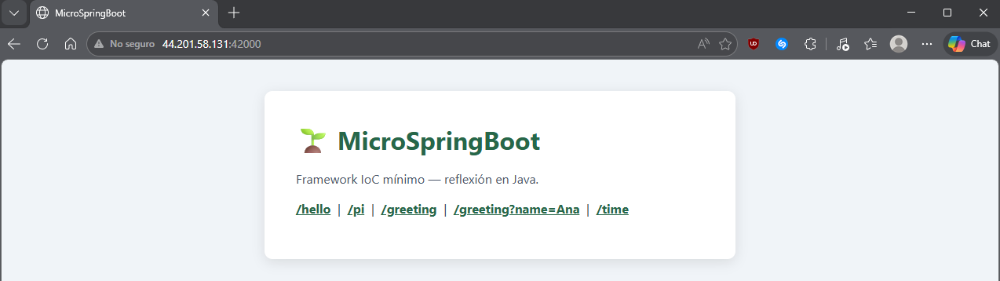

# MicroSpringBoot 🌱

Servidor web HTTP **concurrente** construido en Java puro que implementa un framework **IoC (Inversion of Control)** desde cero, usando reflexión para descubrir y registrar componentes en tiempo de ejecución sin dependencias externas.

## Demo en AWS
> **http://3.230.147.81:42000/**

---

## Descripción

Este proyecto implementa desde cero:

- Servidor HTTP concurrente con pool de hilos fijo (10 hilos simultáneos)
- Apagado elegante (*graceful shutdown*) mediante un JVM Shutdown Hook registrado en su propio hilo
- Escaneo automático del classpath buscando clases anotadas con `@RestController`
- Registro dinámico de rutas mediante `@GetMapping`
- Resolución de parámetros HTTP con `@RequestParam` y valores por defecto
- Invocación de métodos en tiempo de ejecución usando `java.lang.reflect`
- Entrega de archivos estáticos (HTML, CSS, PNG, …)

---

## Arquitectura

```
micro-spring-boot/
├── src/main/java/org/example/microspringboot/
│   ├── MicroSpringBoot.java               # Punto de entrada principal
│   ├── annotations/
│   │   ├── RestController.java            # @RestController
│   │   ├── GetMapping.java                # @GetMapping
│   │   └── RequestParam.java              # @RequestParam
│   ├── framework/
│   │   ├── ComponentScanner.java          # Escanea classpath por reflexión
│   │   ├── DispatcherHandler.java         # Registra rutas e invoca métodos
│   │   └── HttpServer.java                # Servidor TCP/HTTP concurrente + graceful shutdown
│   ├── controllers/
│   │   ├── HelloController.java           # Controlador de ejemplo básico
│   │   └── GreetingController.java        # Controlador con @RequestParam
│   └── examples/
│       ├── Tests.java                     # Anotación @Tests personalizada
│       ├── Foo.java                       # Clase con métodos de prueba
│       ├── RunTests.java                  # Mini framework de testing por reflexión
│       ├── InvokeMain.java                # Invoca main() de cualquier clase por reflexión
│       └── ReflexionNavigator.java        # Explora constructores, campos y métodos
├── src/main/resources/static/             # Archivos estáticos servidos por el servidor
├── src/test/java/                         # Tests automatizados con JUnit
├── Dockerfile                             # Imagen Docker para despliegue
└── docker-compose.yml                     # Orquestación local
```

---

## Diseño de clases

```
MicroSpringBoot (main)
    │
    ├──► ComponentScanner.findRestControllers()
    │         └── Escanea JAR/classpath buscando @RestController por reflexión
    │
    ├──► DispatcherHandler.registerControllers(List<Class<?>>)
    │         └── Lee @GetMapping de cada método → Map<path, Method>
    │
    └──► HttpServer.start()
              ├── ServerSocket.accept() en bucle
              ├── threadPool.submit(handleRequest) → concurrencia
              └── registerShutdownHook() → graceful shutdown
```

---

## Concurrencia

El servidor usa un `ExecutorService` con pool fijo de 10 hilos. El bucle `accept()` nunca se bloquea por una solicitud lenta — cada conexión aceptada se delega inmediatamente a un hilo worker:

```java
private final ExecutorService threadPool = Executors.newFixedThreadPool(10);

while (running.get()) {
    Socket clientSocket = serverSocket.accept();          // solo espera conexiones nuevas
    threadPool.submit(() -> handleRequest(clientSocket)); // delega a un hilo del pool
}
```

En los logs se puede ver cada hilo atendiendo solicitudes en paralelo:
```
[Server][pool-1-thread-1]  GET / HTTP/1.1
[Server][pool-1-thread-2]  GET /favicon.ico HTTP/1.1
[Server][pool-1-thread-3]  GET /hello HTTP/1.1
[Server][pool-1-thread-4]  GET /greeting?name=Ana HTTP/1.1
```

---

## Apagado Elegante (Graceful Shutdown)

Se registra un JVM Shutdown Hook en su propio hilo, tal como requiere el contrato de la JVM
(ver [Baeldung: JVM Shutdown Hooks](https://www.baeldung.com/jvm-shutdown-hooks)).

Al recibir `Ctrl+C` o `docker stop`:

1. Se activa el flag `running = false`
2. Se cierra el `ServerSocket`, desbloqueando el `accept()`
3. Se llama a `threadPool.shutdown()` y se espera hasta 30 s para que los hilos en vuelo terminen
4. Si algún hilo no termina en ese tiempo, se fuerza con `shutdownNow()`

```java
Thread hookThread = new Thread(() -> {
    running.set(false);
    serverSocket.close();
    threadPool.shutdown();
    threadPool.awaitTermination(30, TimeUnit.SECONDS);
}, "shutdown-hook");

Runtime.getRuntime().addShutdownHook(hookThread);
```

Salida al apagar:
```
[Server] Shutdown signal received — stopping gracefully...
[Server] Accept loop exited.
[Server] Graceful shutdown complete.
```

---

## Cómo funciona el IoC (Reflexión en acción)

```java
// 1. Detectar componentes en tiempo de ejecución
if (clazz.isAnnotationPresent(RestController.class)) { ... }

// 2. Registrar rutas leyendo anotaciones de métodos
GetMapping mapping = method.getAnnotation(GetMapping.class);
routes.put(mapping.value(), method);

// 3. Resolver @RequestParam desde el query string
RequestParam rp = parameter.getAnnotation(RequestParam.class);
args[i] = queryParams.getOrDefault(rp.value(), rp.defaultValue());

// 4. Invocar el método dinámicamente sin conocerlo en tiempo de compilación
Object result = method.invoke(controllerInstance, args);
```

---

## Prerrequisitos

- Java 11+
- Maven 3.6+
- Docker 20+

---

## Compilación y ejecución local

### Compilar
```bash
mvn clean package
```

### Ejecutar directamente
```bash
java -jar target/micro-spring-boot-1.0-SNAPSHOT-jar-with-dependencies.jar 8080
```

---

## Despliegue con Docker

### 1. Construir la imagen
```bash
mvn clean package
docker build --tag micro-spring-boot .
```

### 2. Verificar la imagen
```bash
docker images
```

### 3. Correr el contenedor
```bash
docker run -d -p 8080:6000 --name micro-spring-boot-local micro-spring-boot
```

### 4. Verificar que está corriendo
```bash
docker ps
```

### 5. Probar en el browser
```
http://localhost:8080/
http://localhost:8080/greeting?name=David
```

### 6. Ver logs y concurrencia en acción
```bash
docker logs -f micro-spring-boot-local
```

### 7. Probar el graceful shutdown
```bash
# Terminal 1 - ver logs
docker logs -f micro-spring-boot-local

# Terminal 2 - detener
docker stop micro-spring-boot-local
```

---

## Despliegue con Docker Compose

```bash
docker-compose up -d
docker-compose logs -f
docker-compose down
```

---

## Subir imagen a DockerHub

```bash
docker tag micro-spring-boot jcr34/micro-spring-boot
docker login
docker push jcr34/micro-spring-boot:latest
```

---

## Despliegue en AWS EC2

```bash
# 1. En la instancia EC2, instalar Docker
sudo yum update -y
sudo yum install docker -y
sudo service docker start
sudo usermod -a -G docker ec2-user
# (desconectarse y reconectarse para que el grupo tenga efecto)

# 2. Correr el contenedor desde DockerHub
docker run -d -p 42000:6000 --name micro-spring-boot jcr34/micro-spring-boot

# 3. Verificar
docker ps
```

> Abrir el puerto 42000 en el **Security Group** de AWS (TCP, origen 0.0.0.0/0).

Acceder en:
```
http://3.230.147.81:42000/
```

---

## Endpoints disponibles

| Método | URL | Descripción |
|--------|-----|-------------|
| GET | `/` | Página principal |
| GET | `/hello` | Hello World |
| GET | `/pi` | Valor de π |
| GET | `/greeting` | Saludo con nombre por defecto (`World`) |
| GET | `/greeting?name=Ana` | Saludo con `@RequestParam` |
| GET | `/time` | Hora actual del servidor |
| GET | `/about.html` | Página HTML estática |

---

## Tests automatizados

```bash
mvn test
```

Los tests cubren:

- Despacho básico de rutas (`GET /test`)
- `@RequestParam` con valor por defecto
- `@RequestParam` con valor provisto en el query string
- Ruta desconocida devuelve `null`
- `hasRoute()` con rutas existentes y no existentes
- Presencia de la anotación `@RestController`
- Presencia y valor de `@GetMapping` en un método

---

## Evidencia

### App corriendo localmente en Docker



### Logs mostrando concurrencia (múltiples hilos)


### Graceful shutdown al hacer docker stop



### Contenedor corriendo en EC2


### App accesible desde AWS
