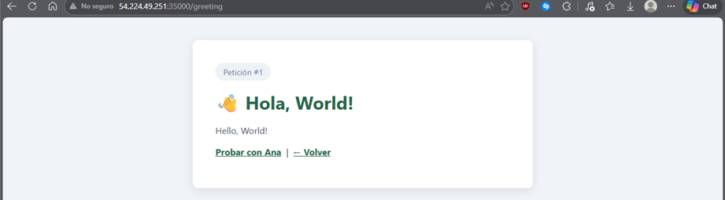
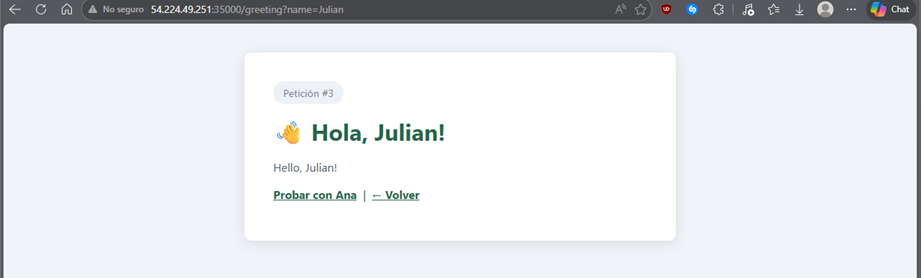
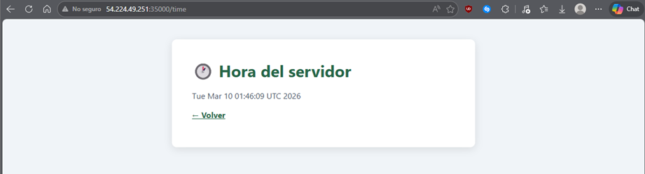

# MicroSpringBoot 🌱

Servidor web HTTP mínimo construido en Java puro que implementa un framework **IoC (Inversion of Control)** desde cero, demostrando las capacidades de reflexión del lenguaje para cargar y registrar componentes en tiempo de ejecución sin dependencias externas.

## Demo en AWS
> **http://54.224.49.251:35000/**

---

## Descripción

Este proyecto implementa desde cero:

- Servidor HTTP capaz de entregar páginas HTML e imágenes PNG
- Escaneo automático del classpath buscando clases anotadas con `@RestController`
- Registro dinámico de rutas mediante `@GetMapping`
- Resolución de parámetros HTTP con `@RequestParam` y valores por defecto
- Invocación de métodos en tiempo de ejecución usando `java.lang.reflect`
- Atención de múltiples solicitudes no concurrentes

---

## Arquitectura
```
micro-spring-boot/
├── src/main/java/org/example/microspringboot/
│   ├── MicroSpringBoot.java               # Punto de entrada principal
│   ├── annotations/
│   │   ├── RestController.java            # @RestController
│   │   ├── GetMapping.java                # @GetMapping
│   │   └── RequestParam.java              # @RequestParam
│   ├── framework/
│   │   ├── ComponentScanner.java          # Escanea classpath por reflexión
│   │   ├── DispatcherHandler.java         # Registra rutas e invoca métodos
│   │   └── HttpServer.java                # Servidor TCP/HTTP puro
│   └── controllers/
│       ├── HelloController.java           # Controlador de ejemplo básico
│       └── GreetingController.java        # Controlador con @RequestParam
└── src/main/resources/static/
    ├── index.html                         # Página de inicio
    └── about.html                         # Página estática de ejemplo
```

---

## Cómo funciona el IoC (Reflexión en acción)
```java
// 1. Detectar componentes en tiempo de ejecución
if (clazz.isAnnotationPresent(RestController.class)) { ... }

// 2. Registrar rutas leyendo anotaciones de métodos
GetMapping mapping = method.getAnnotation(GetMapping.class);
routes.put(mapping.value(), method);

// 3. Resolver @RequestParam desde el query string
RequestParam rp = parameter.getAnnotation(RequestParam.class);
args[i] = queryParams.getOrDefault(rp.value(), rp.defaultValue());

// 4. Invocar el método dinámicamente sin conocerlo en tiempo de compilación
Object result = method.invoke(controllerInstance, args);
```

---

## Prerrequisitos

- Java 11+
- Maven 3.6+

---

## Compilación y ejecución

### Compilar
```bash
mvn clean package
```

### Ejecutar (auto-scan del classpath)
```bash
java -jar target/micro-spring-boot-1.0-SNAPSHOT-jar-with-dependencies.jar
```

### Ejecutar en un puerto específico
```bash
java -jar target/micro-spring-boot-1.0-SNAPSHOT-jar-with-dependencies.jar 35000
```

### Cargar un controlador explícitamente (modo línea de comandos)
```bash
java -cp target/classes org.example.microspringboot.MicroSpringBoot \
     org.example.microspringboot.controllers.HelloController
```

---

## Endpoints disponibles

| Método | URL | Descripción |
|--------|-----|-------------|
| GET | `/` | Página principal |
| GET | `/hello` | Hello World |
| GET | `/pi` | Valor de π |
| GET | `/greeting` | Saludo con nombre por defecto (`World`) |
| GET | `/greeting?name=Ana` | Saludo con `@RequestParam` |
| GET | `/time` | Hora actual del servidor |
| GET | `/about.html` | Página HTML estática |

---

## Ejemplo de controlador personalizado
```java
@RestController
public class MiController {

    @GetMapping("/greeting")
    public String greeting(
        @RequestParam(value = "name", defaultValue = "World") String name) {
        return "Hola, " + name + "!";
    }
}
```

El framework lo descubre automáticamente al arrancar — no hace falta registrarlo en ningún archivo de configuración.

---

## Despliegue en AWS EC2
```bash
# 1. Compilar localmente
mvn clean package

# 2. Subir el JAR a EC2
scp -i key.pem target/micro-spring-boot-1.0-SNAPSHOT-jar-with-dependencies.jar ec2-user@<IP>:~

# 3. Instalar Java en EC2 (Amazon Linux)
sudo yum install java-21-amazon-corretto -y

# 4. Ejecutar
java -jar micro-spring-boot-1.0-SNAPSHOT-jar-with-dependencies.jar 35000
```

> Recuerda abrir el puerto en el **Security Group** de AWS (TCP, puerto 35000, origen 0.0.0.0/0).

---
- Evidencia:





